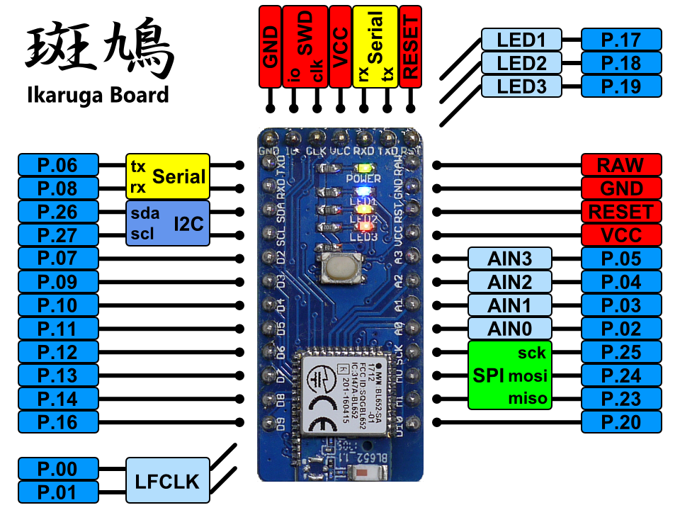
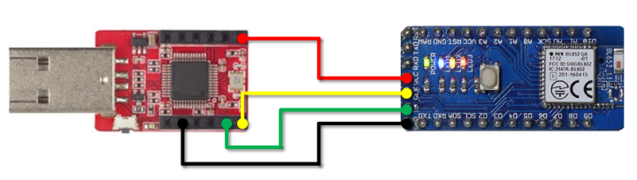
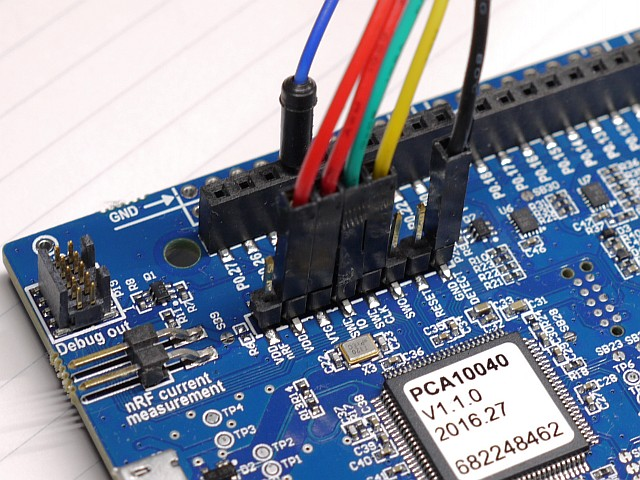
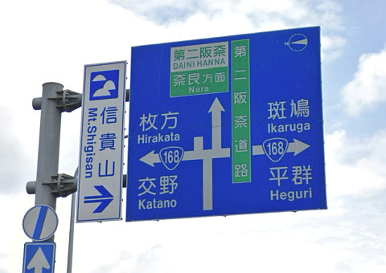

# 斑鳩ボード
## 概要
斑鳩ボードは、Nordic nRF52832搭載のBLEマイコンボードです。 

## 仕様
* BLEマイコンnRF52832搭載 (Bluetooth 4.2 / ARM Cortex-M4F)
* 技適取得済みnRF52832モジュール Liard BL652を使用
* Arduino Pro Miniピン互換 (GR-KURUMIやGR-CITRUSとも共通)
* nRF52-DKの開発環境（mbedやnRF5 SDK）で開発
* nRF52-DK や BLE Nano V2のDAPLinkボードをアダプタとして使う
* 300mAのLDO、3色のLED、32.768kHzサブクロック、リセットスイッチを搭載

## ピン配置


## 開発環境 (mbed)
* mbed Compiperのプラットフォーム選択でNordic nRF52-DKを選びます。
* BLE Nano V2のDAPLinkボードを使う場合、斑鳩を下図ように結線します。
* あとは、ふつうにmbedの要領で開発します。


## nRF52-DKをアダプタに使う場合
最低限、結線が必要なのは以下の4本です。

* GND DETECT　→　ターゲットのGNDに接続
* VTG　→　ターゲットの電源電圧(VDD_nRF)に接続
* SWD CLK　→　ターゲットのSWDCLKに接続
* SWD IO　→　ターゲットのSWDIOに接続

加えて、nRF52-DKボードから斑鳩ボードに給電する場合には以下の2本を結線します。

* GND　→　ターゲットのGNDに接続
* VDD　→　ターゲットの電源電圧(VDD_nRF)に接続


## Ｌチカ (mbed)
```C
#include "mbed.h"

DigitalOut myled1(LED1); // Blue
DigitalOut myled2(LED2); // Yellow
DigitalOut myled3(LED3); // Red

int main() {
    while(1) {
        myled1 = 1;
        wait(0.5);
        myled2 = 1;
        wait(0.5);
        myled3 = 1;
        wait(0.5);
        myled1 = 0;
        wait(0.5);
        myled2 = 0;
        wait(0.5);
        myled3 = 0;
        wait(0.5);
    }
}
```

## ファイル一覧
* hard/Ikaruga/
	* Ikaruga.sch/brd: 回路/基板設計データ(Eagle形式)
	* Ikaruta.pdf: 回路図(PDF)
	* Ikaruga_BOM.xlsx: BOMリスト(Excel形式)
	* Ikaruga.GBL/GBO/GBP/GBS/GML/GTL/GTO/GTP/GTS/TXT: ガーバデータ
* LICENSE: Apache Licence 2.0です。
	* ただし、回路/基板設計は、Creative Commons Attribution Share-Alike 3.0です。
* README.md これ

## 注意
「斑鳩」は「いかるが」と読みます。  
聖徳太子と法隆寺で有名です。難読地名とか言わないでください。


